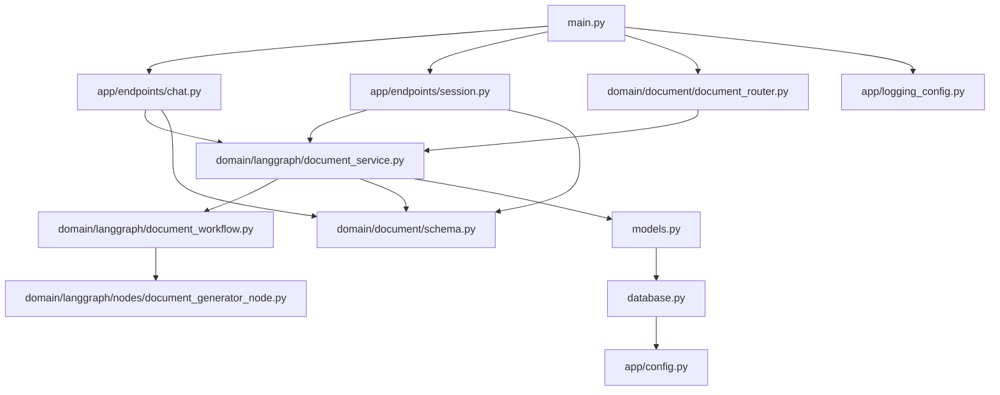

# CICDAutoDoc/fastapi - Project Documentation

## Project Overview
# 프로젝트 개요
## 1. 목적
- 코드 저장소를 분석·요약·문서화하는 LLM 기반 파이프라인을 FastAPI로 제공하여, CI/CD 과정에서 자동 문서 생성과 변경점 반영을 지원

## 2. 주요 기능
- 문서화 파이프라인 제공: LangGraph 기반 워크플로우(document_workflow)로 데이터 로딩 → 저장소/파일 분석 → 요약/생성 → 저장까지 일련의 단계 수행
- 저장소 단위 문서 생성: full_repository_document_generator_node를 통해 전체 리포지토리 문서 일괄 생성
- 변경 분석 및 증분 업데이트: change_analyzer_node로 변경 파일 식별 및 필요한 문서만 갱신
- 코드 파싱 및 요약: tree_sitter_parser, file_parser_node, file_summarizer_node로 정적 파싱과 의미 요약 수행(필요 시 fallback/mock 파서 사용)
- 문서 저장 및 스키마 관리: document_saver_node, domain/document/schema.py, models.py를 통한 결과 저장과 스키마 정의
- 프롬프트 관리와 LLM 실행 추적: prompts, llm_tracking로 프롬프트 템플릿 관리와 호출 로깅
- API 엔드포인트: 
  - 문서/도메인 라우터(domain/document/document_router.py)
  - 대화 및 세션 관리(app/endpoints/chat.py, app/endpoints/session.py)

## 3. 기술 스택 (Frontend/Backend/Database 계층별)
- Frontend
  - 구체적 정보 부족(별도 프론트엔드 미포함 또는 외부 연동 가정)
- Backend
  - Python, FastAPI
  - LangGraph 기반 워크플로우 구성
  - Tree-sitter 기반 파싱(추론: tree_sitter_parser 명시)
  - 로깅 설정(logging_config), 설정 파일(config.py)
- Database
  - SQLAlchemy 기반 모델/ORM(추론: models.py, database.py 존재)
  - DB 종류 및 연결 정보: 구체적 정보 부족

## 4. 아키텍처 개요
- 진입점
  - main.py: FastAPI 애플리케이션 초기화 및 라우터 등록(추론)
- API 레이어
  - app/endpoints/chat.py, session.py: 채팅·세션 관련 엔드포인트
  - domain/document/document_router.py: 문서화 관련 API 라우터
- 도메인/서비스 레이어
  - document_service.py: 문서화 유스케이스 조합 및 호출 지점
  - document_workflow.py: LangGraph 그래프 구성과 단계 정의
  - document_state.py: 파이프라인 상태 관리용 클래스(1개 클래스)
- 파이프라인 노드 레이어(domain/langgraph/nodes)
  - repository_analyzer_node: 저장소 구조·변경 분석
  - data_loader_node: 소스/메타데이터 로딩
  - file_parser_node, parser/tree_sitter_parser|fallback_parser|mock_parser: 파일 파싱
  - file_summarizer_node: 파일 요약 생성
  - document_decider_node: 처리 분기 결정
  - document_generator_node, full_repository_document_generator_node: 문서 생성
  - document_saver_node: 결과 저장
  - change_analyzer_node: 변경점 분석
  - prompts: 프롬프트 템플릿 집합
- 관측/인프라
  - llm_tracking.py: LLM 호출 추적
  - logging_config.py: 로깅 포맷터/핸들러/설정(함수 10, 클래스 1)
  - config.py: 환경설정 로딩(구체적 정보 부족)
- 데이터/영속성
  - models.py: 도메인 모델(클래스 6)
  - database.py: DB 세션/엔진 유틸(함수 1)
- 의존성 흐름
  - 엔드포인트 → 라우터/서비스 → 워크플로우(document_workflow) → 노드 체인(파싱/요약/생성/저장) → ORM/DB
  - 프롬프트/추적은 노드 실행 시 횡단 관심사로 결합

## 5. 강점/특징
- 모듈형 LLM 파이프라인: 노드 단위 분리로 유지보수·확장 용이(여러 노드 파일에 60개+ 함수/여러 클래스 분포)
- 정확한 코드 이해: tree-sitter 파싱 기반으로 언어 구문 인식과 안정적 분석 지원
- 증분 문서화: 변경 분석 노드로 필요한 부분만 재생성하여 비용·시간 절감
- 관측 가능성 강화: llm_tracking과 체계적 로깅으로 추적성과 디버깅 향상
- API 우선 설계: FastAPI 라우터를 통한 외부 시스템·CI/CD 파이프라인과의 손쉬운 연동
- 폴백 전략: 파서/요약/생성 단계에 대안 경로 마련으로 안정성 제고

## Architecture
# 시스템 아키텍처

## 1. 계층 구조
- API 계층
  - app/endpoints/chat.py, app/endpoints/session.py
  - domain/document/document_router.py
  - main.py (애플리케이션 부트스트랩, 라우터 등록 추정)
- 도메인/워크플로 계층
  - domain/langgraph/document_service.py, document_workflow.py, document_state.py
  - domain/langgraph/nodes/* (처리 노드, 프롬프트, 파서)
  - domain/document/schema.py (요청/응답 스키마)
- 영속성 계층
  - models.py (ORM 엔티티, 6개 클래스)
  - database.py (DB 연결/세션 팩토리 추정)
- 설정/관측성 계층
  - app/config.py (환경 설정; 구체적 정보 부족)
  - app/logging_config.py (로깅 설정, 1개 클래스/다수 함수)

## 2. 주요 컴포넌트
- API/라우팅
  - domain/document/document_router.py
    - 역할: 문서 처리 관련 REST 엔드포인트 집합. 요청 검증 및 도메인 서비스 위임.
    - 의존성: domain/document/schema.py, domain/langgraph/document_service.py
    - 복잡도: fn 9 (중간) — 라우팅/검증/에러 매핑 중심.
  - app/endpoints/chat.py, session.py
    - 역할: 채팅/세션 관리 엔드포인트. 범용 세션 수명주기 추정.
    - 의존성: models.py, database.py (세션/상태 관리 추정)
    - 복잡도: 낮음 (fn 1~2).
  - main.py
    - 역할: FastAPI 앱 초기화 및 라우터 포함 추정. 구체적 정보 부족.

- 도메인 서비스/워크플로
  - domain/langgraph/document_service.py
    - 역할: API와 워크플로 사이 어댑터. 입력 검증 후 워크플로 실행/결과 어그리게이션.
    - 의존성: document_workflow.py, document_state.py, models.py
    - 복잡도: cl 1/fn 3 (얇은 조정자).
  - domain/langgraph/document_workflow.py
    - 역할: 문서 처리 그래프 구성/실행. 상태 전파 및 노드 간 분기/병합.
    - 의존성: document_state.py, nodes/*, llm_tracking.py
    - 복잡도: cl 1/fn 5 (핵심 제어 로직).
  - domain/langgraph/document_state.py
    - 역할: 그래프 상태 컨테이너(입력/중간/출력). 단일 클래스.
    - 의존성: nodes 출력 스키마, models.py (필요 시 매핑)
  - domain/document/schema.py
    - 역할: Pydantic 스키마(요청/응답/도메인 DTO), 4개 클래스.
    - 의존성: 라우터/서비스.

- 처리 노드/도구
  - domain/langgraph/nodes/full_repository_document_generator_node.py
    - 역할: 전체 리포지토리 단위 문서 생성(아키텍처/리드미 등). 리포지토리 스캔/요약/통합.
    - 의존성: repository_analyzer_node, file_summarizer_node, prompts.py, llm_tracking.py
    - 복잡도: fn 19/cl 3 (가장 복잡, 핵심 성능 포인트).
  - file_summarizer_node.py
    - 역할: 파일 단위 요약 생성(LLM 프롬프트 기반).
    - 의존성: prompts.py, llm_tracking.py
    - 복잡도: fn 13/cl 1 (중고비용 LLM 호출 가능).
  - change_analyzer_node.py
    - 역할: 변경점 분석(디프/변경 영향 평가).
    - 의존성: repository_analyzer_node (분석 결과), parsers
    - 복잡도: fn 10.
  - repository_analyzer_node.py
    - 역할: 리포지토리 구조/메트릭 수집 및 파일 선택.
    - 의존성: data_loader_node, file_parser_node
    - 복잡도: fn 7.
  - document_decider_node.py, document_generator_node.py, document_saver_node.py, data_loader_node.py, file_parser_node.py
    - 역할: 분기 결정, 문서 생성, 결과 저장, 데이터 로드, 파일 파싱.
    - 의존성: parsers/, prompts.py, models.py/database.py(저장 시)
    - 복잡도: 낮음~중간.
  - parsers (tree_sitter_parser.py, fallback_parser.py, mock_parser.py)
    - 역할: 소스코드 파싱(Tree-sitter 기반 추정), 실패 시 폴백, 테스트용 목.
    - 의존성: 외부 파서 엔진(Tree-sitter; 구체적 정보 부족).
  - prompts.py
    - 역할: LLM 프롬프트 템플릿/헬퍼 모음.
  - llm_tracking.py
    - 역할: LLM 호출 로깅/코스트·토큰 트래킹 훅.

- 영속성/설정/관측성
  - models.py
    - 역할: ORM 엔티티(예: Document, File, Repository, Session 등 추정), 6개 클래스.
    - 의존성: SQLAlchemy 추정. 구체적 스키마 정보 부족.
  - database.py
    - 역할: 엔진/세션 팩토리 제공(트랜잭션 스코프 관리 추정).
  - app/logging_config.py
    - 역할: 구조적 로깅 설정, 핸들러/필터/포맷터 구성.
    - 복잡도: fn 10/cl 1.
  - app/config.py
    - 역할: 환경변수/설정 로딩(Pydantic BaseSettings 추정). 구체적 정보 부족.

## 3. 데이터/제어 흐름
- 문서 처리 파이프라인
  - 1) 클라이언트가 문서 생성/갱신 API 호출 → document_router.py에서 요청 수신
  - 2) schema.py로 입력 검증 → document_service.py에 처리 위임
  - 3) document_service가 초기 document_state 구성 → document_workflow 실행
  - 4) 워크플로 단계
    - data_loader_node: 리포지토리/파일 메타/콘텐츠 로딩
    - file_parser_node: 파일 파싱(Tree-sitter 우선, 실패 시 fallback_parser)
    - repository_analyzer_node: 구조 분석·파일 선택
    - change_analyzer_node: 변경 영향 분석(옵션)
    - document_decider_node: 생성/요약 경로 분기
    - file_summarizer_node: 파일 단위 요약 생성(LLM 호출, prompts/llm_tracking 사용)
    - document_generator_node 또는 full_repository_document_generator_node: 통합 문서 생성
    - document_saver_node: 결과를 models/database를 통해 저장
  - 5) 결과 DTO 매핑 후 라우터로 반환
  - 6) llm_tracking은 각 LLM 호출의 메트릭/로그를 수집

- 채팅/세션 흐름
  - /session 엔드포인트: 세션 생성/조회 → database.py 세션 스코프 내 models.py 저장
  - /chat 엔드포인트: 채팅 메시지 처리(LLM 연계 가능 추정, 구체적 정보 부족) → 세션 컨텍스트 활용

- 애플리케이션 부트/관측성
  - main.py: FastAPI 앱 생성 및 라우터 등록(추정)
  - app/logging_config.py: 앱 시작 시 로깅 초기화
  - app/config.py: 환경 설정 로딩(DB, LLM 키 등; 구체적 정보 부족)

## 4. 설계 고려사항
- 도입: 요청 단위 트랜잭션 스코프(SessionLocal)와 워크플로 저장 단계의 명시적 커밋/롤백 분리
- 강화: full_repository_document_generator_node/file_summarizer_node의 LLM 호출에 대한 재시도/타임아웃/백오프 정책
- 적용: Tree-sitter 파서 재사용 캐시와 파싱 결과 디스크 캐시로 I/O/CPU 비용 절감
- 분리: 장시간 워크플로를 비동기 작업 큐(Celery/Arq/RQ)로 분리하여 API 응답과 처리 decouple
- 추가: llm_tracking에 토큰·비용 집계 및 OpenTelemetry 트레이싱 연동으로 엔드투엔드 추적성 확보
- 검증: document_router 입력(리포지토리 경로/파일 목록)에 대한 화이트리스트·사이즈 제한·압축 해제 검증
- 표준화: prompts.py 템플릿 버전닝·테스트 스냅샷으로 프롬프트 회귀 방지
- 한정: 문서 생성 노드의 동시성 제한(세마포어)과 모델 호출 레이트리밋으로 안정성 확보
- 분리: models.py에서 읽기/쓰기 리포지토리 패턴 도입으로 도메인/ORM 결합도 감소
- 추가: 실패 지점별 보상 트랜잭션(예: 저장 실패 시 임시 산출물 정리)과 워크플로 재시작 포인트 체크포인팅

## Architecture Diagram

## Key Modules
# 핵심 모듈

### 앱 부트스트랩 모듈 (main.py)
- 목적: 애플리케이션 실행 진입점으로 라우터 등록과 전역 초기화를 담당
- 핵심 기능:
  - FastAPI 앱 초기화 및 설정/로깅 로드
  - 라우터 등록(chat, session, document)
  - 애플리케이션 라이프사이클 이벤트 훅 구성
  - 데이터베이스 연결 초기화(구체적 정보 부족)
- 의존성: 내부: 설정 모듈, 로깅 모듈, API 엔드포인트 모듈, 문서 API 라우터, 데이터 영속성 모듈 / 외부: FastAPI, Uvicorn(추론), Pydantic
- 기술 특성: ASGI 기반, 의존성 주입, 환경 기반 부트스트랩
- 개선 포인트:
  - 분리(부트스트랩과 실행 스크립트 분리하여 테스트 용이성 강화)
  - 도입(환경별 설정 프로파일 및 앱 팩토리 패턴)
  - 추가(헬스체크/레디니스/라이브니스 엔드포인트)

### 설정 모듈 (app/config.py)
- 목적: 환경변수와 실행 파라미터를 중앙에서 관리
- 핵심 기능:
  - 환경변수 로드 및 기본값/유효성 검증
  - 외부 서비스 키/엔드포인트 구성 제공
  - 실행 환경(dev/staging/prod)별 파라미터 노출
- 의존성: 내부: 없음 / 외부: pydantic-settings 또는 python-dotenv(구체적 정보 부족)
- 기술 특성: 12-factor 설정, 설정 객체 패턴, 타입 안전성
- 개선 포인트:
  - 도입(.env 스키마 검증과 필수 키 누락 감지)
  - 추가(비밀값 Vault/Secret Manager 연동)
  - 분리(빌드타임/런타임 설정 분리)

### 로깅 모듈 (app/logging_config.py)
- 목적: 일관된 애플리케이션 로깅 설정과 관측성을 제공
- 핵심 기능:
  - 로거/핸들러/포맷터 구성 및 레벨 정책 정의
  - 요청 단위 트레이싱 컨텍스트 처리
  - 외부 라이브러리 로깅 레벨 조정
- 의존성: 내부: 설정 모듈 / 외부: Python logging, uvicorn.logging
- 기술 특성: 구조화 로깅(구체적 정보 부족), 컨텍스트 로깅, 포맷 커스터마이징
- 개선 포인트:
  - 도입(상관관계 ID/트레이스 ID 전파)
  - 추가(로그 회전/보존 및 샘플링 정책)
  - 통합(OpenTelemetry 로그/트레이스/메트릭 연계)

### API 엔드포인트 모듈 (app/endpoints/chat.py, app/endpoints/session.py)
- 목적: Chat 및 세션 관련 REST API 제공
- 핵심 기능:
  - 채팅 요청 수신 및 응답 반환
  - 세션 생성/조회/갱신 관리
  - 입력 검증과 표준 오류 응답
  - 도메인 서비스 호출 및 결과 매핑
- 의존성: 내부: LangGraph 서비스/워크플로, 문서 스키마, 로깅 / 외부: FastAPI, Pydantic
- 기술 특성: APIRouter 구성, 비동기 핸들러, REST 규약
- 개선 포인트:
  - 분리(에러 핸들러와 응답 스키마 표준화)
  - 도입(레이트 리밋/인증·권한 미들웨어)
  - 추가(OpenAPI 문서 예제/응답 코드 정교화)

### 문서 API 라우터 모듈 (domain/document/document_router.py)
- 목적: 문서 생성/분석/저장 관련 엔드포인트 라우팅
- 핵심 기능:
  - 문서 도메인 경로 정의 및 핸들러 바인딩
  - 요청/응답 DTO 매핑과 상태 코드 관리
  - LangGraph 워크플로 트리거 및 결과 반환
- 의존성: 내부: 문서 스키마, LangGraph 서비스/워크플로, 데이터 영속성 / 외부: FastAPI
- 기술 특성: 라우터 모듈화, 의존성 주입, 비동기 트리거링
- 개선 포인트:
  - 도입(API 버저닝 전략)
  - 추가(페이징/필터링/정렬 표준 쿼리 파라미터)
  - 분리(명령/조회 분리하는 CQRS 엔드포인트)

### 문서 스키마 모듈 (domain/document/schema.py)
- 목적: 문서 도메인의 요청/응답 데이터 모델 정의와 검증
- 핵심 기능:
  - Pydantic 기반 DTO/뷰 모델 정의
  - 필드 제약과 비즈니스 규칙 검증
  - 도메인-API 간 변환 헬퍼 제공
- 의존성: 내부: 사용처는 라우터/서비스/노드 / 외부: Pydantic
- 기술 특성: 타입 힌트 기반 검증, 불변/가변 모델 분리(구체적 정보 부족)
- 개선 포인트:
  - 도입(밸리데이터로 교차 필드 검증 강화)
  - 추가(스키마 예제/샘플 payload)
  - 분리(공통 스키마와 문서 전용 스키마)

### LangGraph 서비스/워크플로 모듈 (domain/langgraph/document_service.py, document_workflow.py, document_state.py, llm_tracking.py)
- 목적: 문서 생성·분석을 위한 상태 기반 그래프 오케스트레이션
- 핵심 기능:
  - 문서 처리 그래프 구성(document_workflow) 및 실행
  - 상태 컨테이너(document_state)로 컨텍스트 관리
  - LLM 호출 추적/비용·토큰 관리(llm_tracking)
  - 외부에 노출되는 서비스 파사드(document_service)
- 의존성: 내부: LangGraph 노드 모듈, 파서 서브모듈, 데이터 영속성, 로깅 / 외부: LLM SDK(OpenAI/Anthropic 등, 구체적 정보 부족), asyncio
- 기술 특성: 워크플로/파이프라인 패턴, 상태 머신, 관측성 훅
- 개선 포인트:
  - 도입(워크플로 정의 버전관리와 실험 플래그)
  - 보강(LLM 호출 레이트리밋/캐싱/백오프)
  - 추가(실패 재시도와 보상 트랜잭션)

### LangGraph 노드 모듈 (domain/langgraph/nodes/*.py, domain/langgraph/nodes/prompts.py)
- 목적: 그래프 내 개별 처리 단계 노드 구현
- 핵심 기능:
  - 파일 파싱(file_parser_node) 및 요약(file_summarizer_node)
  - 문서 생성(document_generator_node)과 저장(document_saver_node)
  - 의사결정(document_decider_node), 변경 분석(change_analyzer_node)
  - 저장소 분석(repository_analyzer_node), 전체 저장소 문서화(full_repository_document_generator_node)
- 의존성: 내부: 파서 서브모듈, 프롬프트 정의(prompts), 데이터 영속성, 문서 스키마 / 외부: tree-sitter(파싱), 파일시스템/깃(구체적 정보 부족), LLM SDK
- 기술 특성: 단일 책임 원칙, 프롬프트 엔지니어링, 스트리밍/청크 처리(구체적 정보 부족)
- 개선 포인트:
  - 분리(I/O와 계산 로직 분리하여 테스트성 향상)
  - 병렬화(파일 요약·분석 단계 멀티프로세싱/비동기 배치)
  - 도입(프롬프트 버전관리 및 실험 매개변수화)

### 파서 서브모듈 (domain/langgraph/nodes/parser/*.py)
- 목적: 언어별 코드 구문 분석을 추상화하고 폴백 전략 제공
- 핵심 기능:
  - tree-sitter 기반 정적 파싱(tree_sitter_parser)
  - 폴백/모의 파서(fallback_parser, mock_parser)
  - 언어 감지 및 파서 선택 전략
- 의존성: 내부: 노드 모듈에서 소비 / 외부: tree_sitter, 각 언어 grammar(구체적 정보 부족)
- 기술 특성: 전략 패턴, 어댑터 패턴, 탄력적 실패 처리
- 개선 포인트:
  - 도입(파싱 결과 캐싱 및 인덱싱)
  - 추가(지원 언어 확대와 grammar 동적 로딩)
  - 보강(대용량 파일 스트리밍 파싱 및 메모리 사용 최적화)

### 데이터 영속성 모듈 (database.py, models.py)
- 목적: 데이터베이스 연결과 ORM 모델 정의로 영속성 계층을 제공
- 핵심 기능:
  - DB 엔진/세션 팩토리 초기화(database.py)
  - 도메인 엔티티 ORM 매핑(models.py)
  - 트랜잭션 경계 및 세션 스코프 관리
- 의존성: 내부: 서비스/노드/라우터에서 사용 / 외부: SQLAlchemy 또는 유사 ORM(구체적 정보 부족)
- 기술 특성: 리포지토리/유닛오브워크(구체적 정보 부족), 연결 풀링, 마이그레이션 연동(구체적 정보 부족)
- 개선 포인트:
  - 도입(Alembic 마이그레이션 및 자동 스키마 관리)
  - 분리(읽기/쓰기 세션과 리포지토리 인터페이스)
  - 추가(데이터 접근 계층 테스트용 인메모리 DB)

## Changelog

