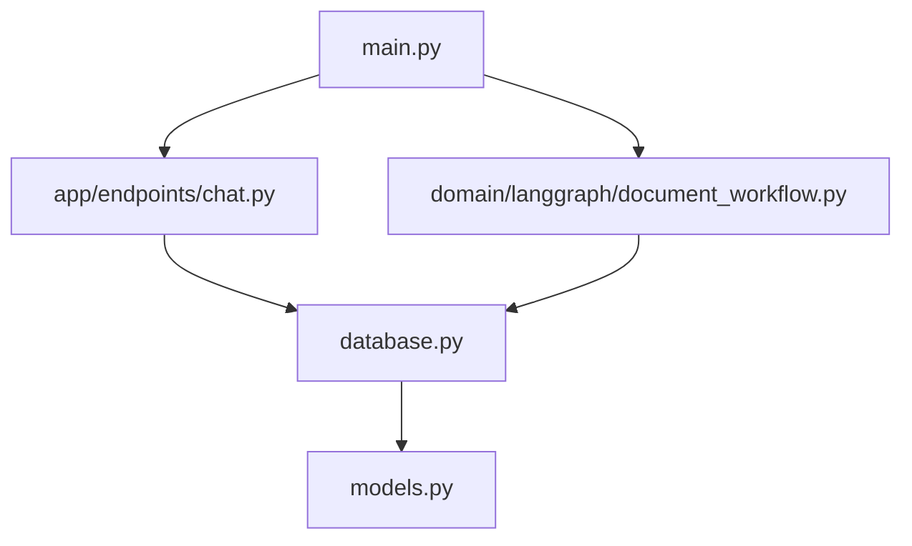
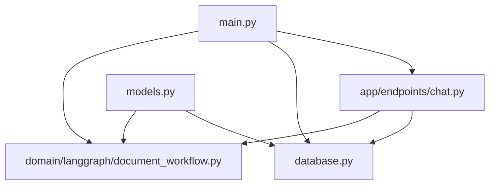

# CICDAutoDoc-FastAPI 문서

## 프로젝트 개요
# 프로젝트 개요

## 1. 목적
CICDAutoDoc-FastAPI 프로젝트는 FastAPI를 사용하여 자동화된 문서 생성 및 관리를 지원하는 REST API 서비스를 제공하는 것을 목적으로 합니다.

## 2. 주요 기능
- 채팅 관련 REST API 엔드포인트 제공
- 데이터베이스 연결 및 세션 관리
- LangGraph 기반 문서 생성 워크플로우
- SQLAlchemy ORM 모델 정의

## 3. 기술 스택
- 언어: 
  - Python
- 프레임워크: 
  - FastAPI
- 데이터: 
  - SQLAlchemy

## 4. 아키텍처 개요
이 프로젝트는 FastAPI를 메인 애플리케이션 진입점으로 사용하며, LangGraph를 기반으로 문서 생성 워크플로우를 관리합니다. 데이터베이스 연결 및 세션 관리는 별도의 모듈로 처리됩니다.

## 5. 강점/특징
- FastAPI를 사용한 고성능 비동기 API 제공
- LangGraph 기반의 문서 생성 워크플로우로 효율적인 문서 관리
- SQLAlchemy를 통한 ORM으로 데이터베이스 조작 간소화
- REST API를 통한 채팅 기능 지원

## 아키텍처 분석
# 시스템 아키텍처

## 1. 계층 구조
- **프레젠테이션 계층**: 사용자와의 상호작용을 담당하는 부분으로, `app/endpoints/chat.py`가 포함됩니다.
- **애플리케이션 계층**: 비즈니스 로직을 처리하며, `main.py`와 `domain/langgraph/document_workflow.py`가 포함됩니다.
- **데이터 계층**: 데이터 저장 및 관리를 담당하며, `database.py`와 `models.py`가 포함됩니다.

## 2. 주요 컴포넌트
- **app/endpoints/chat.py**: 채팅 관련 REST API 엔드포인트를 제공하여 사용자 요청을 처리합니다.
- **main.py**: FastAPI 메인 애플리케이션의 진입점으로, 전체 애플리케이션의 실행을 시작합니다.
- **domain/langgraph/document_workflow.py**: LangGraph 기반의 문서 생성 워크플로우를 관리합니다.
- **database.py**: 데이터베이스 연결 및 세션 관리를 담당합니다.
- **models.py**: SQLAlchemy ORM을 사용하여 데이터베이스 모델을 정의합니다.

## 3. 데이터/제어 흐름
- 사용자는 `app/endpoints/chat.py`를 통해 REST API 요청을 보냅니다.
- `main.py`는 애플리케이션의 진입점으로, 요청을 적절한 엔드포인트로 라우팅합니다.
- `domain/langgraph/document_workflow.py`는 문서 생성 워크플로우를 처리합니다.
- 데이터베이스 관련 작업은 `database.py`와 `models.py`를 통해 수행됩니다.

## 4. Mermaid 다이어그램

## 5. 설계 고려사항
- **확장성**: 새로운 기능 추가 시 `app/endpoints`와 `domain` 디렉토리 구조를 활용하여 모듈화된 방식으로 구현합니다.
- **유지보수성**: 코드의 가독성을 높이기 위해 각 모듈의 역할을 명확히 하고, 주석과 문서화를 철저히 합니다.
- **성능 최적화**: 데이터베이스 쿼리 최적화 및 캐싱 전략을 도입하여 성능을 개선합니다.

## 핵심 모듈
# 핵심 모듈

### app/endpoints/chat.py
- 목적: 채팅 관련 REST API 엔드포인트 제공
- 핵심 기능:
  - 채팅 메시지 전송
  - 채팅 기록 조회
  - 사용자 상태 업데이트
  - 채팅방 생성 및 삭제
- 의존성: 알 수 없음
- 개선 포인트:
  - API 문서화 추가
  - 에러 핸들링 강화

### database.py
- 목적: 데이터베이스 연결 및 세션 관리
- 핵심 기능:
  - 데이터베이스 연결 설정
  - 세션 생성 및 관리
  - 연결 종료 처리
- 의존성: 알 수 없음
- 개선 포인트:
  - 연결 풀링 도입
  - 로깅 기능 추가

### domain/langgraph/document_workflow.py
- 목적: LangGraph 기반 문서 생성 워크플로우 관리
- 핵심 기능:
  - 문서 생성 프로세스 정의
  - 워크플로우 상태 관리
  - 문서 버전 관리
  - 사용자 알림 전송
- 의존성: 알 수 없음
- 개선 포인트:
  - 워크플로우 최적화
  - 테스트 커버리지 확대

### main.py
- 목적: FastAPI 메인 애플리케이션 진입점
- 핵심 기능:
  - 애플리케이션 초기화
  - 라우팅 설정
  - 미들웨어 구성
- 의존성: 알 수 없음
- 개선 포인트:
  - 환경 설정 파일 분리
  - 보안 설정 강화

### models.py
- 목적: SQLAlchemy ORM 모델 정의
- 핵심 기능:
  - 데이터베이스 테이블 매핑
  - 관계 설정
- 의존성: 알 수 없음
- 개선 포인트:
  - 모델 유효성 검사 추가
  - 인덱스 최적화

