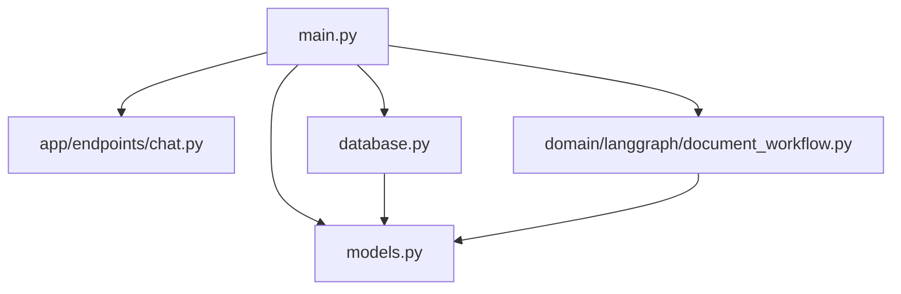
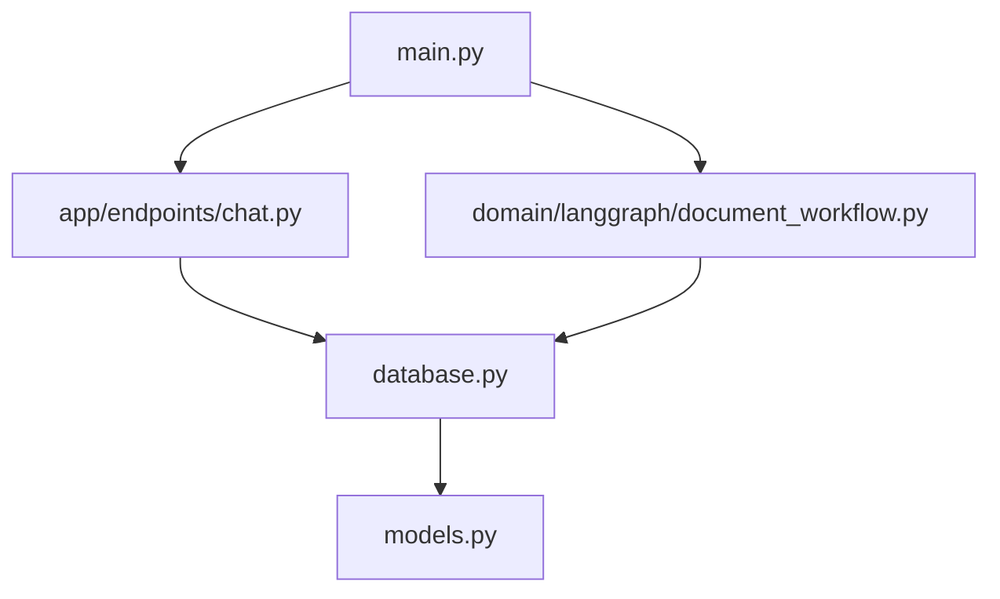
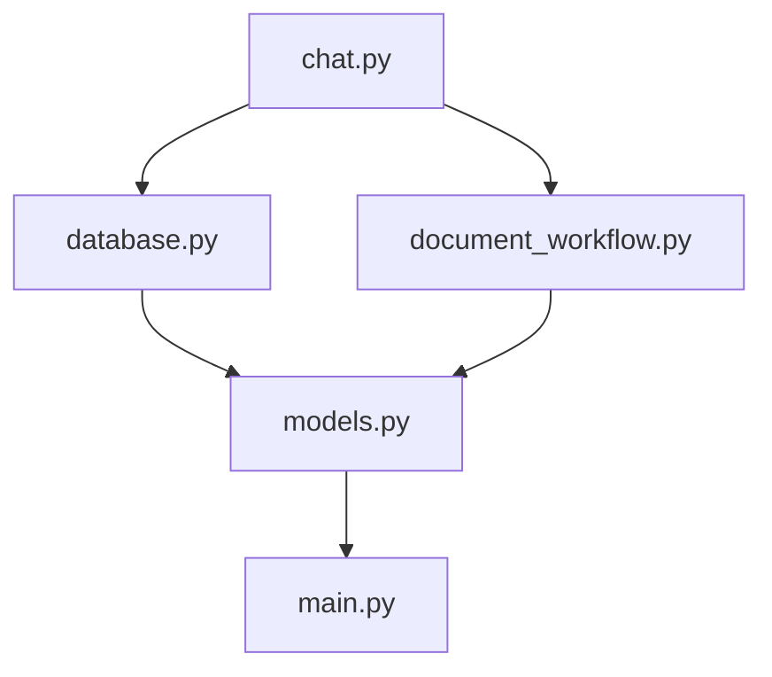

# CICDAutoDoc-FastAPI 문서

## 프로젝트 개요
# 프로젝트 개요

## 1. 목적
CICDAutoDoc-FastAPI 프로젝트의 목적은 FastAPI 기반의 REST API를 통해 자동화된 문서 생성 및 관리를 지원하는 것입니다.

## 2. 주요 기능
- 채팅 관련 REST API 엔드포인트 제공
- 데이터베이스 연결 및 세션 관리
- LangGraph 기반 문서 생성 워크플로우
- SQLAlchemy ORM 모델 정의

## 3. 기술 스택
- 언어: Python
- 프레임워크: FastAPI
- 데이터: SQLAlchemy, LangGraph

## 4. 아키텍처 개요
FastAPI를 메인 애플리케이션 진입점으로 사용하고, SQLAlchemy를 통해 데이터베이스와 상호작용합니다. LangGraph를 활용하여 문서 생성 워크플로우를 관리합니다.

## 5. 강점/특징
- FastAPI를 활용한 고성능 비동기 REST API
- LangGraph를 통한 효율적인 문서 생성
- SQLAlchemy를 사용한 데이터베이스 관리
- 간결하고 유지보수 가능한 코드 구조
- 자동화된 문서 관리 기능 제공

## 아키텍처 분석
# 시스템 아키텍처

## 1. 계층 구조
- **프레젠테이션 계층**: `app/endpoints/chat.py` - 채팅 관련 REST API 엔드포인트
- **애플리케이션 계층**: `main.py` - FastAPI 메인 애플리케이션 진입점
- **도메인 계층**: `domain/langgraph/document_workflow.py` - LangGraph 기반 문서 생성 워크플로우
- **데이터 계층**: `database.py` - 데이터베이스 연결 및 세션 관리, `models.py` - SQLAlchemy ORM 모델 정의

## 2. 주요 컴포넌트
- **채팅 엔드포인트**: REST API를 통해 채팅 기능 제공
- **메인 애플리케이션**: FastAPI로 애플리케이션 초기화 및 실행
- **문서 워크플로우**: LangGraph를 활용한 문서 생성 프로세스 관리
- **데이터베이스 관리**: 데이터베이스 연결 및 세션 관리
- **ORM 모델**: SQLAlchemy를 사용한 데이터베이스 모델 정의

## 3. 데이터/제어 흐름
- `main.py`에서 애플리케이션이 시작되고, `app/endpoints/chat.py`를 통해 API 요청을 처리
- `domain/langgraph/document_workflow.py`는 문서 생성 요청을 처리
- `database.py`와 `models.py`는 데이터베이스와의 상호작용을 관리

## 4. Mermaid 다이어그램

## 5. 설계 고려사항
- 도입: FastAPI의 비동기 기능을 활용하여 성능 최적화
- 분리: 데이터베이스 관련 로직을 별도의 모듈로 분리하여 유지보수성 향상
- 추가: 문서 워크플로우의 확장성을 고려한 모듈화

## 핵심 모듈
# 핵심 모듈

### chat.py
- 목적: 채팅 관련 REST API 엔드포인트 제공
- 핵심 기능:
  - 채팅 메시지 전송
  - 채팅 기록 조회
  - 사용자 상태 업데이트
  - 채팅방 생성 및 삭제
- 의존성: 알 수 없음
- 개선 포인트:
  - API 문서화 추가
  - 오류 처리 로직 강화

### database.py
- 목적: 데이터베이스 연결 및 세션 관리
- 핵심 기능:
  - 데이터베이스 연결 설정
  - 세션 생성 및 종료
  - 트랜잭션 관리
- 의존성: 알 수 없음
- 개선 포인트:
  - 연결 풀링 도입
  - 로깅 기능 추가

### document_workflow.py
- 목적: LangGraph 기반 문서 생성 워크플로우 관리
- 핵심 기능:
  - 문서 생성 프로세스 정의
  - 워크플로우 상태 전환
  - 문서 검토 및 승인
- 의존성: 알 수 없음
- 개선 포인트:
  - 워크플로우 시각화 도구 도입
  - 사용자 알림 기능 추가

### main.py
- 목적: FastAPI 메인 애플리케이션 진입점
- 핵심 기능:
  - 애플리케이션 초기화
  - 라우팅 설정
  - 서버 실행
- 의존성: 알 수 없음
- 개선 포인트:
  - 환경 설정 파일 분리
  - 테스트 자동화 도입

### models.py
- 목적: SQLAlchemy ORM 모델 정의
- 핵심 기능:
  - 데이터베이스 테이블 매핑
  - 관계 설정
- 의존성: 알 수 없음
- 개선 포인트:
  - 모델 유효성 검사 추가
  - 데이터베이스 마이그레이션 도구 도입

