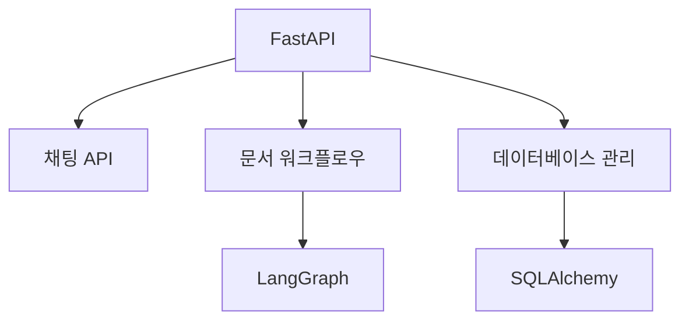
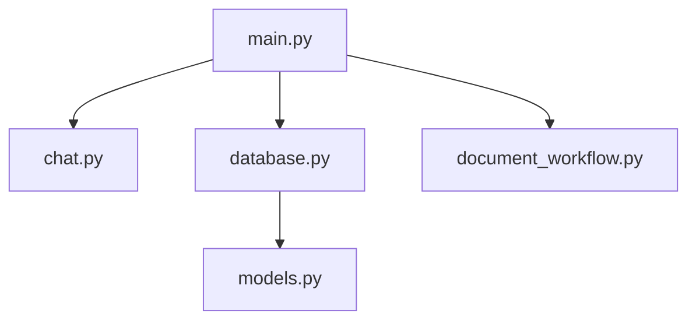
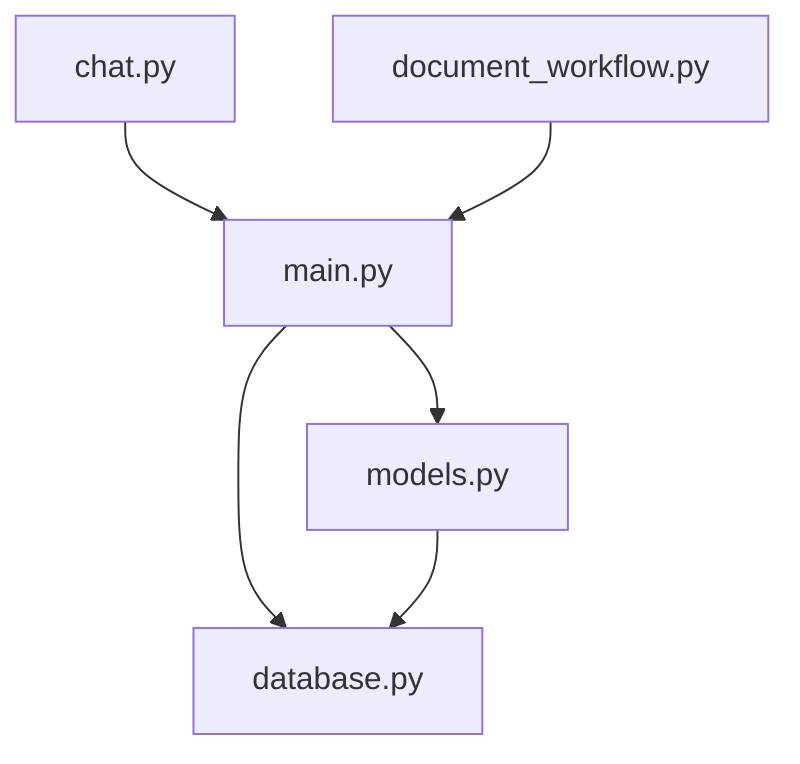

# CICDAutoDoc-FastAPI 문서

## 프로젝트 개요
# 프로젝트 개요

## 1. 목적
CICDAutoDoc-FastAPI는 FastAPI 기반의 문서 자동화 시스템입니다. 

## 2. 주요 기능
- 채팅 관련 REST API 제공
- 데이터베이스 연결 및 세션 관리
- 문서 생성 워크플로우 관리
- SQLAlchemy ORM 모델 정의

## 3. 기술 스택
- 언어: Python
- 프레임워크: FastAPI
- 데이터: SQLAlchemy

## 4. 아키텍처 개요
FastAPI를 메인으로 사용하며, LangGraph를 통한 문서 워크플로우와 SQLAlchemy ORM을 활용한 데이터 관리가 포함됩니다.

## 5. 강점/특징
- FastAPI 기반의 빠른 API 개발
- LangGraph로 문서 생성 자동화
- SQLAlchemy로 데이터베이스 관리
- REST API로 채팅 기능 제공

## 아키텍처 분석
# 시스템 아키텍처

## 1. 계층 구조
- 애플리케이션 계층
- 데이터베이스 계층
- 도메인 계층

## 2. 주요 컴포넌트
- `main.py`: FastAPI 진입점
- `chat.py`: 채팅 REST API
- `database.py`: DB 연결 관리
- `document_workflow.py`: 문서 생성 워크플로우
- `models.py`: ORM 모델 정의

## 3. 데이터/제어 흐름
- `main.py`에서 애플리케이션 시작
- `chat.py`로 API 요청 처리
- `database.py`로 DB 연결
- `document_workflow.py`에서 문서 처리
- `models.py`로 데이터 모델 정의

## 4. Mermaid 다이어그램

## 5. 설계 고려사항
- FastAPI 사용으로 비동기 처리
- ORM으로 데이터베이스 추상화
- 워크플로우 모듈화로 유지보수성 강화

## 핵심 모듈
# 핵심 모듈

### chat.py
- 목적: 채팅 관련 REST API 엔드포인트
- 핵심 기능:
  - 채팅 메시지 전송
  - 채팅 기록 조회
- 의존성: 알 수 없음
- 개선 포인트:
  - 에러 처리 로직 강화

### database.py
- 목적: 데이터베이스 연결 및 세션 관리
- 핵심 기능:
  - 데이터베이스 연결 설정
  - 세션 생성 및 관리
- 의존성: 알 수 없음
- 개선 포인트:
  - 연결 풀링 최적화

### document_workflow.py
- 목적: LangGraph 기반 문서 생성 워크플로우
- 핵심 기능:
  - 문서 생성 프로세스 관리
  - 워크플로우 상태 추적
- 의존성: 알 수 없음
- 개선 포인트:
  - 워크플로우 자동화 도입

### main.py
- 목적: FastAPI 메인 애플리케이션 진입점
- 핵심 기능:
  - 애플리케이션 초기화
  - 라우팅 설정
- 의존성: 알 수 없음
- 개선 포인트:
  - 초기화 로직 분리

### models.py
- 목적: SQLAlchemy ORM 모델 정의
- 핵심 기능:
  - 데이터베이스 테이블 매핑
  - 모델 속성 정의
- 의존성: 알 수 없음
- 개선 포인트:
  - 모델 간 관계 명확화

