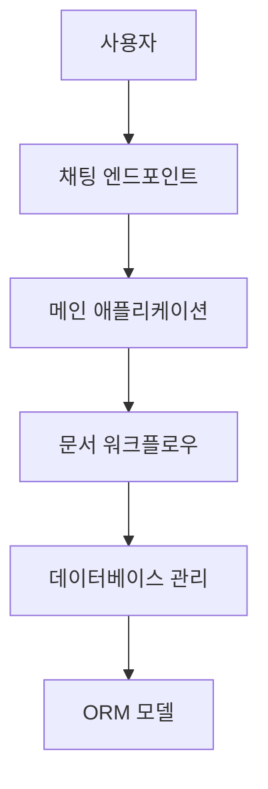

# CICDAutoDoc-FastAPI 문서

## 프로젝트 개요
# 프로젝트 개요

## 1. 목적
CICDAutoDoc-FastAPI 프로젝트의 목적은 FastAPI를 활용하여 자동화된 문서 생성 및 관리를 지원하는 REST API 서비스를 제공하는 것입니다.

## 2. 주요 기능
- 채팅 관련 REST API 엔드포인트 제공
- 데이터베이스 연결 및 세션 관리
- LangGraph 기반 문서 생성 워크플로우
- SQLAlchemy ORM 모델 정의

## 3. 기술 스택
- 언어: 
  - Python
- 프레임워크: 
  - FastAPI
- 데이터: 
  - SQLAlchemy

## 4. 아키텍처 개요
이 프로젝트는 FastAPI를 메인 애플리케이션 진입점으로 사용하며, LangGraph를 기반으로 문서 생성 워크플로우를 관리합니다. 데이터베이스 연결 및 세션 관리는 별도의 모듈에서 처리됩니다.

## 5. 강점/특징
- FastAPI를 활용한 고성능 비동기 API 제공
- LangGraph 기반의 문서 생성 워크플로우로 효율적인 문서 관리
- SQLAlchemy를 통한 ORM 모델링으로 데이터베이스 관리 용이
- 모듈화된 구조로 유지보수 및 확장성 용이

{"section":"overview","version":"v4"}

## 아키텍처 분석
# 시스템 아키텍처

## 1. 계층 구조
- **프레젠테이션 계층**: 사용자와의 상호작용을 처리하는 부분으로, REST API 엔드포인트를 통해 요청을 수신합니다.
- **애플리케이션 계층**: 비즈니스 로직을 처리하며, 문서 생성 워크플로우를 관리합니다.
- **데이터 계층**: 데이터베이스와의 상호작용을 담당하며, ORM을 통해 데이터 모델을 정의합니다.

## 2. 주요 컴포넌트
- **채팅 엔드포인트 (app/endpoints/chat.py)**: 채팅 관련 REST API를 제공합니다.
- **데이터베이스 관리 (database.py)**: 데이터베이스 연결 및 세션을 관리합니다.
- **문서 워크플로우 (domain/langgraph/document_workflow.py)**: LangGraph를 기반으로 문서 생성 워크플로우를 처리합니다.
- **메인 애플리케이션 (main.py)**: FastAPI를 사용하여 애플리케이션의 진입점을 제공합니다.
- **ORM 모델 (models.py)**: SQLAlchemy를 사용하여 데이터베이스 모델을 정의합니다.

## 3. 데이터/제어 흐름
- 사용자가 채팅 엔드포인트를 통해 요청을 보냅니다.
- 메인 애플리케이션이 요청을 수신하고 적절한 비즈니스 로직을 호출합니다.
- 문서 워크플로우가 LangGraph를 사용하여 문서 생성을 처리합니다.
- 데이터베이스 관리 모듈이 ORM 모델을 통해 데이터베이스와 상호작용합니다.

## 4. Mermaid 다이어그램

## 5. 설계 고려사항
- **확장성**: 모듈 간의 명확한 역할 분리를 통해 시스템 확장성을 고려합니다.
- **유지보수성**: 코드의 모듈화를 통해 유지보수성을 높입니다.
- **성능**: 데이터베이스와의 효율적인 연결 관리를 통해 성능을 최적화합니다.

{"section":"architecture","version":"v4"}

## 핵심 모듈
# 핵심 모듈

### app/endpoints/chat.py
- 목적: 채팅 관련 REST API 엔드포인트 제공
- 핵심 기능:
  - 채팅 메시지 전송
  - 채팅 기록 조회
  - 사용자 상태 업데이트
  - 채팅방 생성 및 삭제
- 의존성: 알 수 없음
- 개선 포인트:
  - API 문서화 추가
  - 에러 처리 로직 강화

### database.py
- 목적: 데이터베이스 연결 및 세션 관리
- 핵심 기능:
  - 데이터베이스 연결 설정
  - 세션 생성 및 관리
  - 연결 종료 처리
- 의존성: 알 수 없음
- 개선 포인트:
  - 연결 풀링 도입
  - 예외 처리 로직 개선

### domain/langgraph/document_workflow.py
- 목적: LangGraph 기반 문서 생성 워크플로우 관리
- 핵심 기능:
  - 문서 생성 프로세스 정의
  - 워크플로우 상태 관리
  - 문서 검증 및 승인
  - 사용자 알림 전송
- 의존성: 알 수 없음
- 개선 포인트:
  - 워크플로우 단계 추가
  - 사용자 피드백 수집 기능 도입

### main.py
- 목적: FastAPI 메인 애플리케이션 진입점
- 핵심 기능:
  - 애플리케이션 초기화
  - 라우팅 설정
  - 서버 실행
- 의존성: 알 수 없음
- 개선 포인트:
  - 환경 설정 파일 분리
  - 로깅 기능 강화

### models.py
- 목적: SQLAlchemy ORM 모델 정의
- 핵심 기능:
  - 데이터베이스 테이블 매핑
  - 모델 간 관계 설정
- 의존성: 알 수 없음
- 개선 포인트:
  - 모델 유효성 검사 추가
  - 데이터베이스 마이그레이션 도구 통합

{"section":"modules","version":"v4"}
